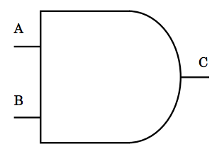

# Arquitecturas y Entidades

A continuación continuaremos con la explicación de algunas
características presentes en las __Architectures and Entities__.

## Asignación Concurrente de Señales

Veamos un ejemplo a continuación:


```vhdl
select <= 0 WHEN s0 = '0' AND s1 = '0' ELSE
        1 WHEN s0 = '1' AND s1 = '0' ELSE
        2 WHEN s0 = '0' AND s1 = '1' ELSE
        3;
```

En un lenguaje como __C__ o __C++__, cada asignación se ejecuta de
manera totalmente secuencial, una después de la otra en un orden
especificado. Básicamente puede decirse que el orden de ejecución es
determinado por el orden de las sentencias en el archivo fuente. En
__VHDL__, no hay un orden específico de las sentencias de asignación.
El orden de ejecución es totalmente especificado por los eventos que
ocurren sobre las señales a las cuales una sentencia de asignación es
sensible.

Por ejemplo una asignación es identificada por el símbolo __<=__. De
manera tal en el ejemplo anterior, la señal llamada __select__ obtendrá
un valor numérico que será asignado de acuerdo a los valores __s0__ y
__s1__. Ésta sentencia será ejecutado cuando la señal __s0__ o __s1__
cambien. Normalmente un sentencia de asignación de señales es sensible a
los cambios en cualquier señal que se encuentra a la derecha del símbolo
__<=__. En este caso se puede decir que la señal __select__ es sensible
a las señales __s0__ y __s1__.

# Modelado Comportamental

Ya hemos visto algunos conceptos básicos de VHDL, ahora vamos a ver un
poco más a profundidad de que se trata el modelado comportamental,
algunos procesos de test bench y síntesis de modelos en __VHDL__.


## Introduction to Behavioral Modeling

La sentencia de asignación de señales es la forma más básica de modelado
comportamental en __VHDL__. Veamos un ejemplo:

```vhdl
a <= b;
```

La sentencia anterior es leída cómo: __a__ obtiene el valor de __b__. El
efecto de ésta asignación, es que el valor actual de __b__ es asignado a
la señal __a__. Ésto será ejecutado cuando el valor de la señal __b__
cambie. La señal __b__ está en la lista de sensibilidad de la
asignación.

Por ejemplo la siguiente sentencia nos muestra cómo asignar un valor con
un retraso de __10 ns__.

```vhdl
a <= b after 10 ns;
```
Con los anteriores ejemplos, es posible utilizar una asignación concurrente
de señales para modelar una compuerta __and__ como podremos ver a
continuación.

```vhdl
ENTITY and2 IS
        PORT ( a, b : IN BIT;
                c : OUT BIT );
END and2;

ARCHITECTURE arqAnd2 OF and2 IS
BEGIN
        c <= a AND b AFTER 5 ns;
END arqAnd2;
```

A continuación podemos ver un diagrama esquemático de una compuerta __and__.



El diseño de esta compuerta, como ya se ha mencionado tiene en su lista
de sensibilidad 2 señales, __a__ y __b__, si alguna de ellas cambia
pueden pasar 2 cosas. En el caso de una compuerta __and__, si __a__ es
igual a '0' y __b__ cambia de '1' a __0__, la salida __c__ no cambia.
Ahora si la salida cambia de valor, entonces una transacción ocurre la
cual causa que un evento sea calendarizado sobre la señal __c__; en otro
caso, una transaccion ocurre sobre la señal __c__.

En nuestro ejemplo de compuerta __and__ el valor de la expresión __a__ y
__b__ es calculado en primera instancia, y el valor resultante del
cálculo es calendarizado sobre la salida __c__ 5 nano segundos despues
de que el cálculo esté completo.

### Ejemplo Multiplexor de 4 Entradas

Ahora veamos un ejemplo con un conjunto de asignaciones un poco más
complicadas con el objetivo de demostrar el concepto de concurrencia en
mayor detalle.

Recordemos que un __Multiplexor__ es un dispositivo que nos permite
seleccionar una salida a partir de un conjunto de valores de entrada.

En la siguiente figura podemos ver el diagrama de un multiplexor de 4
entradas, que podemos utilizar como la entidad que deberemos modelar:


El modelo comportamenta para éste multiplexor puede estar dado por:

```vhdl
LIBRARY IEEE;
USE IEEE.std_logic_1164.ALL;

ENTITY mux4 IS
PORT (i0, i1, i2, i3, i4, a, b : IN std_logic
                            q : OUT std_logic);
END mux4;

ARCHITECTURE arq_mux4 OF mux4 IS
SIGNAL sel: INTEGER;
BEGIN
    WITH sel SELECT
        q <= i0 AFTER 10 ns WHEN 0,
            i1 AFTER 10 ns WHEN 1,
            i2 AFTER 10 ns WHEN 2,
            i3 AFTER 10 ns WHEN 3,
            'X' AFTER 10 ns WHEN OTHERS;

    sel <= 0 WHEN a = '0' AND b = '0' ELSE
        1 WHEN a = '1' AND b = '0' ELSE
        2 WHEN a = '0' AND b = '1' ELSE
        3 WHEN a = '1' AND b = '1' ELSE
        4;
END arq_mux4;
```

La entidad para este modelo tiene seis puertos de entrada, cuatro de
éstas entradas (__i0, i1, i2, i3__) representan los valores que serán
asignados a la salida __q__. Sólo una de las entradas sera asignada a
la vez, el valor que se asigne dependerá de las señales de entrada __a__
y __b__ quiénes típicamente se conocen como selectores. A continuación
podemos ver la tabla de verdad de este multiplexor.


Cómo podemos ver en el diseño de la arquitectura, se pueden ver dos
asignaciones principales, la primer asignación es realizada con el
condicional __SELECT__ y la cláusula __WHEN__, esto es una asignación
condicional que depende directamente de los valores que tome la señal
__sel__, cómo podemos ver las señales que se definen dentro de la
arquitectura deben definirse entre la definicion de __ARCHITECTURE__ y
el __BEGIN__ de la arquitectura como tal. Para el ejemplo, __sel__ se
tomará como una señal de tipo __INTEGER__. Si analizamos detenidamente
la primer asignación no se realizará hasta tanto el valor de la señal
__sel__ no cambie.

La señal __sel__ por su parte es asignada en la segunda asignación, de
manera tal que aquí podemos ver el concepto de concurrencia
efectivamente. Así que debido a esto el diseño está bien construidos,
garantizando que los valores de la señal __sel__ estarán definidos para
cuando el diseño entre en "acción".

# Taller

* Realizar en VHDL, utilizando la herramienta ISE Design Suite los
  diseños vistos en clase hasta ahora, es decir la compuerta __and__ y
  el multiplexor en cuestión.
* Investigar por qué motivo en el diseño del multiplexor se utiliza otro
  tipo señales de entrada, **std_logic** en lugar de __bit__. Cuándo
  usar un tipo o el otro ?
* Adicionalmente construir diseños para una compuerta __or__ y __not__.
* Todos los diseños deberán tener su __test bench__, serán revisados la
  siguiente clase.
* Definan por favor los grupos de trabajo.
