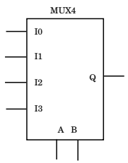
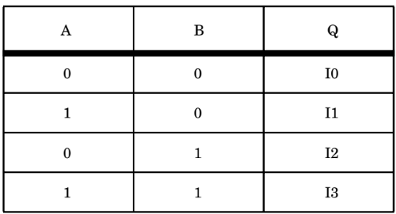

# Sequential Processing

Las sentencias secuenciales son aquellas que tienden a ejecutarse de manera serial en nuestro diseño, de manera diferente a los diseños totalmente comportamentales en los cuales es claro que existen muchas asignaciones concurrentes. La mayoría de lenguajes de programación como C/C++, soportan este tipo de comportamiento. De hecho, __VHDL__ toma la sintaxis de este tipo de diseño de [__ADA__](http://www.adacore.com/adaanswers/about/ada).

## Sentencia Process

En una arquitectura definida para una entidad, todas las sentencias son concurrentes. Nos preguntamos entonces ¿ donde existe secuencialidad en __VHDL__ ?. Existe una sentencia, o palabra reservada, conocida como _sentencia process_ la cual internamente sólo contendrá sentencias secuenciales. Un _process_ puede existir en una arquitectura y definir regiones en la arquitectura donde todas las sentencias son secuenciales.

Una sentencia *process* tiene una sección de declaraciones y una parte donde se definen las sentencias. En la seccion de declaraciones se deben declarar los tipos, variables, constantes, subprogramas entre otras. La parte de las sentencias contiene solo sentencias netamente secuenciales. Entre las sentencias de este tipo están __CASE__, __IF THEN ELSE__, __LOOP__, entre otras.

## Lista de Sensibilidad

La sentencia *process* tiene una lista de sensibilidad explícita. Ésta lista define las señales que causan que las sentencias definidas dentro del _process_ se ejecuten cuándo uno o más elementos de la lista cambien de valor. La lista de sensibilidad es una lista de las señales que causarán que el _process_ se ejecute.

## Ejemplo de un Process

Vamos a construir un multiplexor aprovechando el procesamiento secuencial que se permite realizar en __VHDL__.

```vhdl
library IEEE;
use IEEE.STD_LOGIC_1164.ALL;

entity muxPCSource is
    Port ( PCDisp30 : in  STD_LOGIC_VECTOR (31 downto 0);
           PCDisp22 : in  STD_LOGIC_VECTOR (31 downto 0);
           PC4 : in  STD_LOGIC_VECTOR (31 downto 0);
           PCAddress : in  STD_LOGIC_VECTOR (31 downto 0);
           PCSource : in  STD_LOGIC_VECTOR (1 downto 0);
           PCAddressOut : out  STD_LOGIC_VECTOR (31 downto 0));
end muxPCSource;

architecture arqMuxPCSource of muxPCSource is

begin
	process(PCDisp30,PCDisp22,PC4,PCAddress,PCAddress,PCSource) -- Lista de Sensibilidad
	begin
		case PCSource is
			when "00" =>
				PCAddressOut <= PCAddress;
			when "01" =>
				PCAddressOut <= PCDisp30;
			when "10" =>
				PCAddressOut <= PCDisp22;
			when "11" =>
				PCAddressOut <= PC4;
			when others =>
				PCAddressOut <= PC4;
		end case;
	end process;
end arqMuxPCSource;
```
Como se puede ver en el diseño, tenemos un __MUX__ de 5 entradas, de las cuales la señal llamada __PCSource__ va a funcionar como el selector, y tenemos 4 entradas entre las cuáles se seleccionará la salida correcta a colocarse en __PCAddressOut__. Las sentencias dentro del __process__ se ejecutan sólo si alguna de las señales definidas dentro del _process_ cambia de valor.

El diseño tiende a tener un parecido a un lenguaje de programación típico. Todo lo que está internamente en el _process_ se ejecutara de manera serial. También es importante mencionar que una arquitectura puede tener múltiples _process_ lo cuales entre ellos sí se ejecutarían de manera concurrente según sea el caso.

## Signal Assignment Versus Variable Assignment

Vamos a intentar mostrar las diferencias que existen cuando se definen __signals__ y __variables__ dentro de un diseño que aprovecha los _process_ para su funcionamiento. 

En primera instancia vamos a evaluar un diseño de un multiplexor como se puede ver en la siguiente gráfica:





Nuestro primer diseño será un diseño incorrecto, el cual genera fallas en su funcionamiento.

### Ejemplo Multiplexor Incorrecto

El siguiente ejemplo tiene una falla en su construcción. No es un problema sintáctico.

```vhdl
LIBRARY IEEE;
USE IEEE.std_logic_1164.ALL;

ENTITY mux IS
PORT (i0,i1,i2,i3,a,b : IN std_logic;
					q : OUT std_logic);
END mux;

ARCHITECTURE wrong of mux IS
	SIGNAL muxval : INTEGER; -- Se define una señal
BEGIN
	PROCESS (i0,i1,i2,i3,a,b)
	BEGIN
		muxval <= 0; -- Las actualizaciones de las señales no son inmediatas. Generalmente tienen un retraso.
		IF (a = '1') THEN
			muxval <= muxval + 1; -- Debido al retraso, el valor de muxval que se modifica aquí tiene basura
		END IF;
		
		IF (b = '1') THEN
			muxval <= muxval + 2; -- De igual manera en este punto tampoco tendríamos un valor válido para el primer caso.
		END IF;
		
		CASE muxval IS
			WHEN 0 => 
				q <= i0 AFTER 10 ns;
			WHEN 1 =>
				q <= i1 AFTER 10 ns;
			WHEN 2 =>
				q <= i2 AFTER 10 ns;
			WHEN OTHERS =>
				NULL;
		END CASE;
	END PROCESS;
END wrong;
```


