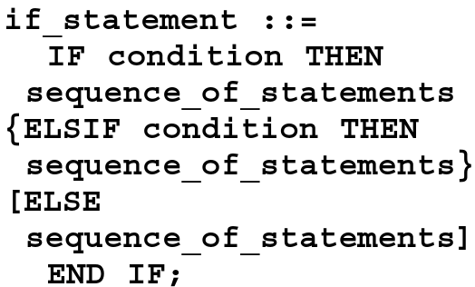
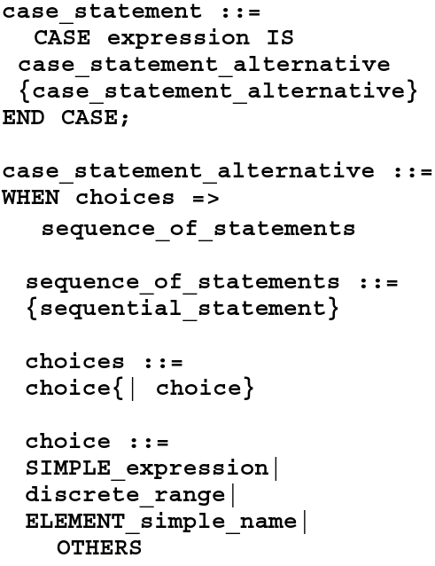
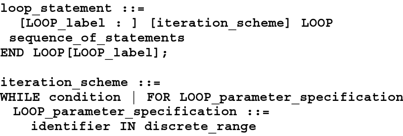

# Sequential Processing

Vamos a continuar con una recapitulación de algunas sentencias secuenciales.

## Sentencias Secuenciales

Las sentencias de este tipo existen en el entorno de una sentencia **process** y también en subprogramas. En este momento vamos a analizar las sentencias que se definen generalmente al interior de un **process**.

### Sentencia IF

A continuación se mostrará una notación de la sentencia **IF**, conocida como __ Bachus-Naur Format (BNF)__ muy usada para explicar sintácticamente lenguajes como __VHDL__.



La sentencia **IF**, como muchos ya saben, inicia con la palabra clave **IF** y finaliza con **END IF** escrito como dos palabras separadas. Existen dos sentencias que pueden usarse de manera opcional en el **IF** y son **ELSIF**, la cual se puede repetir, es decir más de un **ELSIF** puede ser usado, sin embargo también es posible usar **ELSE**, la cual sólo puede ser usado una vez dentro de un **IF**. El condicional que debe ir siempre deberá ser una expresión booleana. 

Veamos algunos ejemplos de su uso:

```vhdl
IF (x < 10) THEN
  a := b;
END IF;
```

Ahora veamos uno donde se utilizan mas sentencias dentro de nuestro ejemplo:

```vhdl
IF (day = sunday) THEN
  weekend := TRUE;
ELSIF (day = saturday) THEN
  weekend := TRUE;
ELSE
  weekday := TRUE;
END IF;
```

### Sentencias CASE

La sentencia __CASE__ es utilizada normalmente cuando vamos a seleccionar un valor de un número de opciones diferentes. El BNF para la sentencia __CASE__ puede verse a continuación:



Esta sentencia consiste de la palabra reservada __CASE__ seguida por una expresión y la palabra reservada __IS__. La expresión retornará un valor que concuerda con alguna de las __CHOICES__ en la sentencia __WHEN__, o concordará con la sentencia __OTHERS__.

Veamos un par de ejemplos de uso de esta sentencia:

```vhdl
CASE instruction IS
  WHEN load_accum =>
    accum <= data;
  WHEN store_accum =>
    data_out <= accum;
  WHEN load|store =>
    process_IO(addr);
  WHEN OTHERS =>
    process_error(instruction);
END CASE;
```
Ahora veamos un ejemplo un poco más complejo, en el cual se utiliza un tipo de dato creado por el diseñador:

```vhdl
TYPE vectype IS ARRAY(0 TO 1) OF BIT;
VARIABLE bit_vec : vectype;
.
.
.

CASE bit_vec IS
  WHEN "00" =>
    RETURN 0;
  WHEN "01" =>
    RETURN 1;
  WHEN "10" =>
    RETURN 2;
  WHEN "11" =>
    RETURN 3;
END CASE;
```

En este último caso se está mostrando una forma en la cual podría convertirse un arreglo de bits en un entero.

### Sentencias LOOP

La sentencia __LOOP__ es usada cuando una operación necesita ser repetida. A continuación puede verse su __BNF__:


