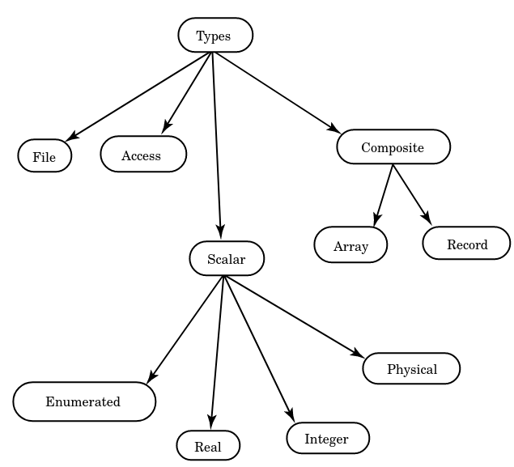

# Tipos de datos

Todos los objetos que hemos visto hasta ahora - la señal, la variable y la constante - Pueden ser declarados usando una especificación de tipo que especifica las características del objeto. __VHDL__ contiene un amplio rango de tipos que pueden ser usados para crear objetos simples o complejos. 

Para definir un nuevo tipo, se debe crear una declaración de tipo. Una declaración de tipo define el nombre del tipo y el rango de el tipo. Las declaraciones de tipo son permitidas en las secciones de declaración de paquetes, entidades, arquitecturas, subprogramas y procesos. 

Una declaración de tipo se ve de la siguiente forma:

```vhdl
TYPE type_name IS type_mark;
```

La construcción __type_mark__ cubre un amplio rango de metodos para especificar el tipo. Puede ser cualquier tipo de enumeración de todos los valores pertenecientes al tipo. A continuación vamos a ver algunos __type_mark__. En la siguiente figura podemos ver un diagrama que muestra los tipos disponible en __VHDL__. Las cuatro categorías mas amplias son tipos escalares, compuestos, de acceso y tipos de archivo. Los tipos escalares incluyen todos los tipos simples tales como enteros y reales. Los tipos compuestos incluyen arreglos y registros. Los tipos de acceso son equivalentes a punteros en lenguajes de programación típicos. Finalmente, los tipos archivo le permiten al diseñador la habilidad de declarar objectos __file__.



## Tipos Escalares

