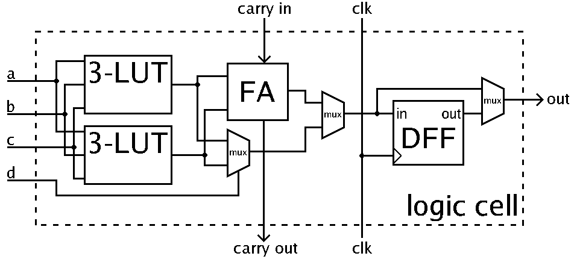
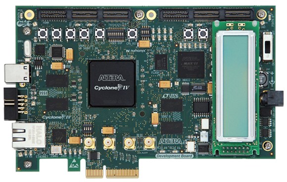
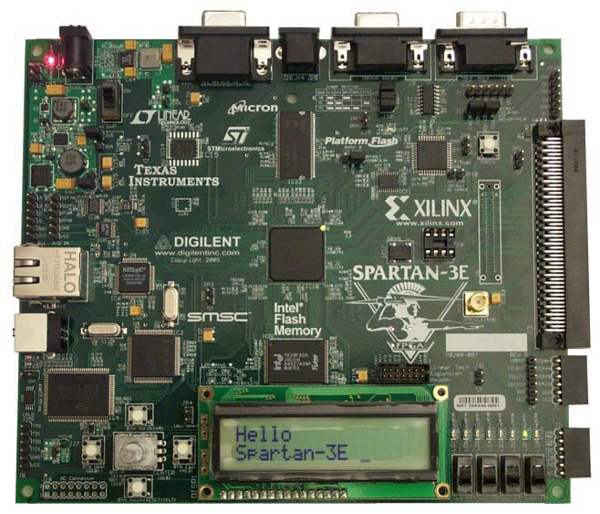

# ¿ Qúe es una FPGA ?

Una __FPGA__ (__Field Programmable Gate Array__) es un circuito integrado
diseñado para ser configurado y adecuarlo a las necesidades que se
tengan.

La configuración de una FPGA es generalmente especificada usando un
lenguaje de descripción de hardware (Hardware Description Language).

Una FPGA contiene un arreglo de bloques lógicos programables, y una
jerarquía de interconexiones reconfigurables que permiten que los
bloques sean "cableados en conjunto", algo similar a lo que sucede
cuando se inter-conectan compuertas lógicas en muchas configuraciones.
Los bloques lógicos pueden ser configurados para realizar funciones
combinatorias complejas, o para simplemente construir compuertas AND y
XOR. En la mayoría de las FPGAs, los bloques lógicos también contienen
elmentos de memoria, los cuales pueden ser Flip-Flops sencillos o
bloques de memoria aún más complejos.

## Arquitectura de una FPGA

## ¿ Qué es un bloque lógico ?

En computación, un bloque lógico o bloque lógico configurable
(__Configurable Logic Block__) es un bloque de construcción fundamental
de una __FPGA__. Los bloques lógicos pueden ser configurados para
obtener compuertas lógicas configurables.

Los bloques lógicos son la parte más común en la arquitectura de una
__FPGA__, son usualmente dispuestos dentro de una matriz de bloques
lógicos. Estos bloques necesitan generalmente puertos de entrada/salida
(I/O) (para interconectarse con señales externas a la FPGA), y canales
de ruteo (para interconexión de bloques lógicos).

### Arquitectura de un Bloque Lógico

En general, un bloque lógico consiste de unas cuantas celdas lógicas.
Una celda lógica típica contiene 4 __LUT__ (__Look Up Tables__), un
sumador completo (__FA__) y un flip-flop tipo D, como puede verse en la
figura.

En la actualidad la mayoría de fabricantes han empezado a utilizar LUTs
de 6 entradas para aprovecharlas en rutas críticas de los diseños
buscando una mejora del desempeño.



## Hard Blocks (Bloques Fijos)

Las familas de __FPGAS__ modernas incluyen funcionalidad de alto nivel
integrando directamente en silicio algunas características específicas.
Es común en la actualidad encontrar bloques fijos de __DSP__,
procesadores embebidos e inclusive memorias.

## Clocking

La mayoría de la circuitería presente en una __FPGA__ es síncrona, es
decir requiere una señal de reloj. Las __FPGAs__ contienen redes
globales y regionales dedicadas para señales de reloj y reset de manera
que se disminuya al máximo el skew del dispositivo. En una __FPGA__ es
posible realizar diseños que tengan diferentes frecuencias de reloj y
fases distintas.

## Arquitecturas en 3D

Con el fin de disminuir el tamaño y consumo de potencia de las
__FPGAs__, algunos fabricantes han introducido arquitecturas 3D. Un
ejemplo de esto son las __FPGAs__ de la serie 7 de __Xilinx__, las
cuales contienen algunos sectores de alta densidad en las cuales se
usan múltiples dies en un solo _package_.


# Diseño y Programación de una __FPGA__

Para definir el comportamiento de una __FPGA__, el usuario debe
construir un diseño utilizando un lenguaje de descripción de hardware
(__Hardware Description Language__ - __HDL__) o también a través de un
diseño esquemático. El uso de __HDL__ es el más recomendado para
trabajar con grandes estructuras porque es posible definirlas
automáticamente y no tener que dibujarlas una a una.

Entonces, usando una herramiento de diseño electrónico, como el ISE de
Xilinx, un mapeo conocido como __netlist__ es generado. Éste __netlist__
puede ser llevado a la arquitectura de la __FPGA__ usando un proceso
llamado __place-and-route__, que es usualmente realizado por el software
específico de la compañía creadora de la __FPGA__ utilizada. El usuario
normalmente puede validar el mapeo, el proceso de __place-and-route__
utilizando análisis de tiempos, simulación entre otras metodologías de
verificación. Una vez el proceso de diseño y validación es completo, un
archivo binario es generado (de igual manera su generación estará atada
al software de la empresa de la __FPGA__) el cuál será utilizado para
configurar o re-configurar la __FPGA__. Este archivo es transferido a la
__FPGA__ a través de una interface serial conocida como __JTAG__ o en
algunos casos a una memoria externa como una __EEPROM__.

Los lenguajes de descripción de hardware mas utilizados son __VHDL__ y
__Verilog__, aunque en un intento por facilitar los procesos de diseño
de Hardware, National Instruments tiene un lenguaje de programación
gráfico que puede usarse para programar hardware sobre la __FPGA__.

Para simplificar el diseño de sistemas complejos sobre la __FPGA__,
existen diversas librerías de funciones complejas y circuitos que han
sido probados y optimizados para acelerar nuestros procesos de diseño.
Estos circuitos predefinidos son comúnmente conocidos como __IP Cores__,
y están disponibles a través de los fabricantes de __FPGAs__ y algunos
otros proveedores. También existen algunos circuitos disponibles para la
comunidad en general conocidos como __OpenCores__.

Algunos ejemplos de sistemas de desarrollo con __FPGAs__ se pueden ver a
continuación:






")


# __VHDL__ (VHSIC Hardware Description Language)

El lenguaje de descripción de Hardware (__VHDL__ - __Very High Speed Integrated Circuit Language Description Language__) es un lenguaje estándar usado para describir hardware desde un nivel abstracto a un nivel concreto. __VHDL__ resultó de un trabajo realizado por el Departamento de Defensa de Estados Unidos entre los años 70 y 80. Sus raíces parten del lenguaje ADA.

## Términos usados en VHDL

Es importante tener claridad de algunos conceptos que se manejan en el
lenguaje como tal.

### Entidad

Todos los diseños son expresados en términos de entidades. Una entidad
es el bloque de construcción más básico en un diseño. Generalmente
contiene internamente las arquitecturas de los diseños. En una entidad
normalmente se define el conjunto de entradas y salidas de un diseño.

### Arquitectura

Todas las entidades que pueden ser simuladas contienen internamente una
arquitectura. La arquitectura describe el comportamiento de la entidad.
Una única entidad puede contener internamente varias arquitecturas.

### Package

Un package es una colección de tipos de datos y subprogramas usados en
un diseño. Un package puede verse como un Tool-Box que contiene
herramientas que nos ayudan en el proceso de diseño.

### Process

Un Process es la unidad básica de ejecución en VHDL. Todas las
operaciones que son realizadas en una simulación de una descripción en
__VHDL__ generalmente se dividen en uno o varios __process__.

## Entidad (Entity)

En __VHDL__ una entidad debe definirse con su nombre, los puertos de la
entidad, y alguna información concerniente a la entidad. Todos los
diseños son creados usando una o más entidades.

Veamos un pequeño ejemplo de una entidad:

```vhdl
ENTITY mux IS
    PORT(a, b, c, d : IN BIT;
        s0, s1 : IN BIT;
        x, : OUT BIT);
END mux;
```

## Cómo usar el ISE Design Suite de Xilinx

[](https://www.youtube.com/watch?v=mDLdiAA1d_E)

[](https://www.youtube.com/watch?v=qifLAgU77uE)


